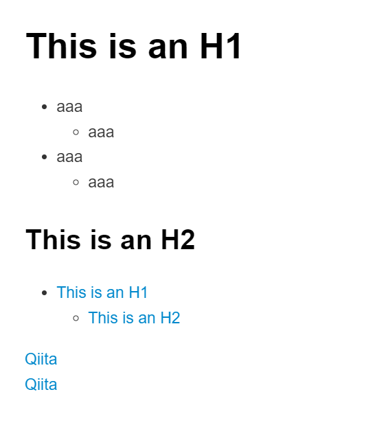

# This is an H1

- aaa
  - aaa
- aaa
  - aaa

## This is an H2

- [This is an H1](#this-is-an-h1)
  - [This is an H2](#this-is-an-h2)

[Qiita](https://qiita.com/oreo/items/82183bfbaac69971917f)
[Qiita](http://qiita.com "Qiita")

